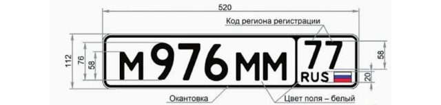
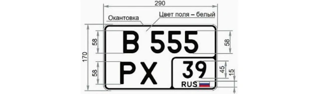
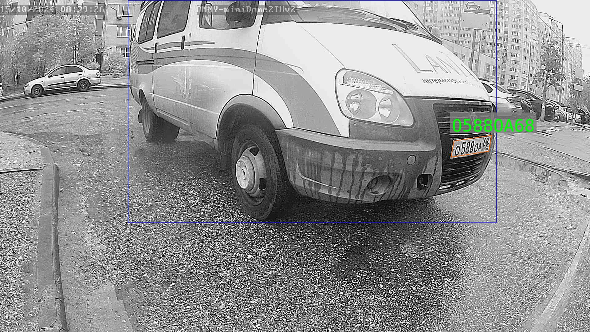
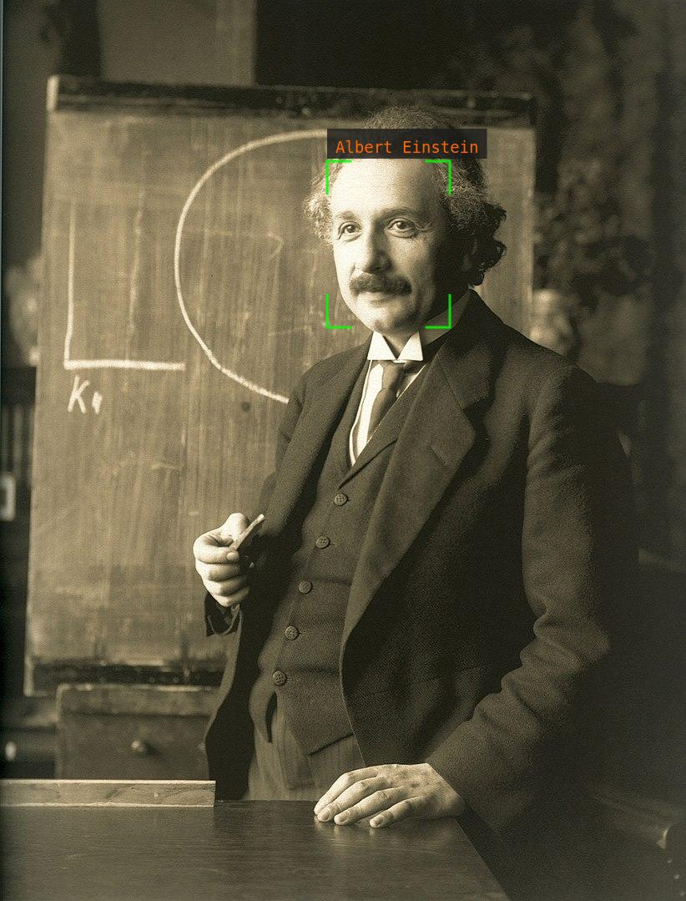
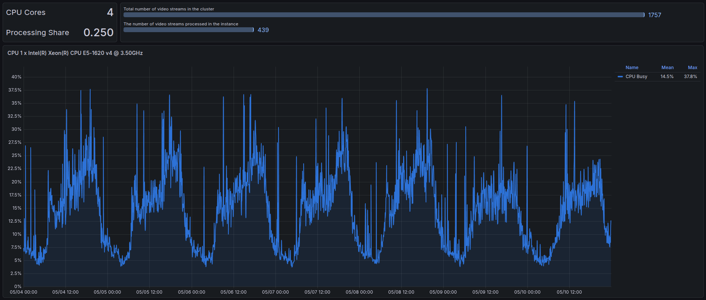
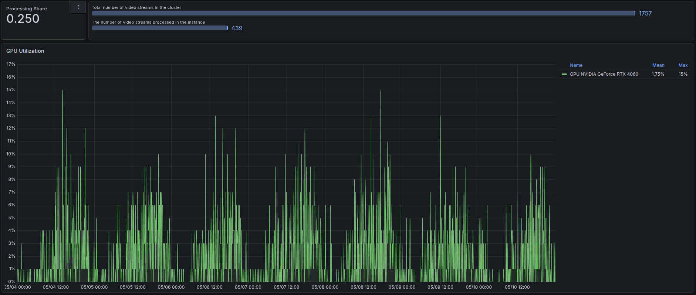
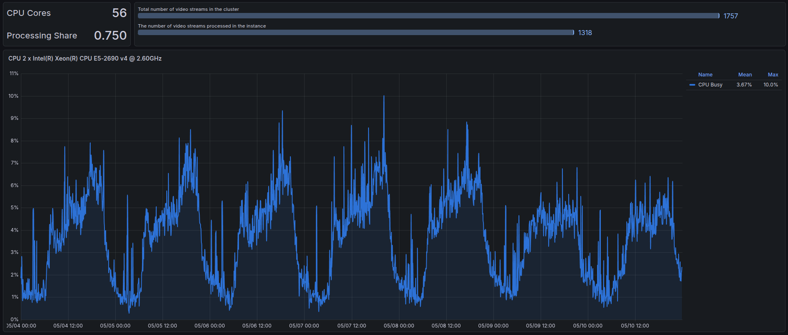
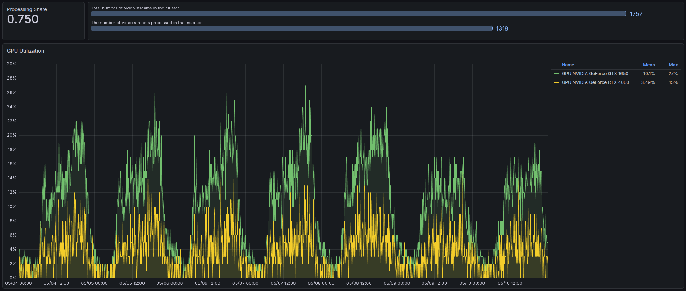

## [](https://github.com/rosteleset/falprs/blob/main/README.md) FALPRS Project Description
This project is a replacement for the [old one](https://github.com/rosteleset/frs). Key differences:
* PostgreSQL is used as the DBMS.
* The project uses [userver](https://github.com/userver-framework/userver) — an open-source asynchronous framework.
* Strict data type compliance in API requests. For example, if a numeric field is expected, it must not be enclosed in quotes.
* Added license plate recognition system (LPRS).

### Table of Contents
* [LPRS](#lprs)
  * [Neural Network Models Used](#lprs_used_dnn)
  * [General Scheme of Interaction with LPRS](#lprs_scheme)
  * [Automatic Plate Banning](#lprs_auto_ban)
* [FRS](#frs)
  * [Neural Network Models Used](#frs_used_dnn)
  * [General Scheme of Interaction with FRS](#frs_scheme)
* [Project Build and Configuration](#build_and_setup_falprs)
   * [System Requirements](#system_requirements)
   * [NVIDIA Driver Installation](#install_drivers)
   * [Docker Engine Installation](#install_de)
   * [NVIDIA Container Toolkit Installation](#install_ct)
   * [PostgreSQL Installation](#install_pg)
   * [Environment Variables](#env_vars)
   * [Building the Project](#build_falprs)
   * [Creating TensorRT Plans for Neural Network Models](#create_models)
   * [Project Configuration](#config_falprs)
   * [Managing Video Stream Groups](#vstream_groups)
* [Project Update](#update_falprs)
* [Examples](#examples)
   * [LPRS](#lprs_examples)
   * [FRS](#frs_examples)
* [Tests](#tests)
   * [LPRS](#lprs_tests)
   * [FRS](#frs_tests)
* [Data Synchronization with the Deprecated FRS Project](#frs_sync_data)
* [Examples of CPU and GPU Load Charts](#cpu_gpu_load)

<a id="lprs"></a>
## LPRS
The system is designed for license plate recognition and detection of special vehicles with sirens: ambulances, emergency services, police, etc. Currently, Russian registration plates of type 1 (GOST R 50577-93) and 1A (GOST R 50577-2018) are supported:



<a id="lprs_used_dnn"></a>
### Neural Network Models Used
The service works with five neural networks: VDNet, VCNet, LPDNet, LPCNet, and LPRNet. VDNet is designed to search for vehicles in the captured image from the video camera. VCNet determines whether each found vehicle is a special vehicle. LPDNet is designed to search for license plates. LPCNet classifies the found plates. LPRNet is designed for plate recognition from the data obtained by LPDNet. The VDNet, LPDNet, and LPRNet models are trained using [Ultralytics](https://github.com/ultralytics/ultralytics). The VCNet and LPCNet models are obtained through transfer learning with fine-tuning. [This model](https://huggingface.co/WinKawaks/vit-small-patch16-224) is used as the base.
[NVIDIA Triton Inference Server](https://developer.nvidia.com/triton-inference-server) is used for neural network inference.

<a id="lprs_scheme"></a>
### General Scheme of Interaction with LPRS 
The [API](https://rosteleset.github.io/falprs/) is used to interact with the service, a detailed description of which is in the repository in the **docs/openapi.yaml** file. First, you need to register the video streams that the system will work with. The **addStream** API method is used for this. Main parameters:
- **streamId** — internal identifier for your backend (external for LPRS) for the video stream;
- **config** — configuration parameters.
Example request body:
```json
{
  "streamId": "1234",
  "config": {
    "screenshot-url": "https://my.video.stream/capture",
    "callback-url": "https://my.host/callback?streamId=1"
  }
}
```
Now LPRS knows that frame capture should be done using the specified **screenshot-url** parameter, and upon detection of special vehicles or license plate recognition, send brief information via HTTP POST to the **callback-url**.
To start LPRS processing frames, call the **startWorkflow** API method.
Example request body:
```json
{
  "streamId": "1234"
}
```
The system will start a cyclic process: capturing a frame, processing it with neural networks, and sending information to the **callback-url** if required. Then a pause for some time, and capturing a frame again, processing, etc. To stop the process, call the **stopWorkflow** API method.
Example request body:
```json
{
  "streamId": "1234"
}
```
To reduce system load, we recommend calling **startWorkflow** and **stopWorkflow**, for example, in accordance with the camera's video analytics: motion detector, line crossing, intrusion detection, etc. When receiving brief information about recognized plates, your backend should process it. For example, check the obtained plates against the allowed list and open the gates or simply ignore them. Plate recognition events are stored in LPRS for some time. If full event information is required, use the **getEventData** API method.
The **removeStream** API method is used to delete a video stream. Use **listStreams** to get information about the video streams registered in LPRS.

<a id="lprs_auto_ban"></a>
### Automatic Plate Banning
To prevent callback request spamming, a two-stage plate banning is used. If the system sees a plate for the first time, it will end up in the first banning stage after processing: for some time (configuration parameter **ban-duration**), the plate is ignored regardless of its location in the frame. If the system sees this plate again in the first stage, the ban time is extended. After the first stage ends, the plate moves to the next one. In the second banning stage (configuration parameter **ban-duration-area**), the plate is ignored as long as it does not change its position in the frame. When the position changes (configuration parameter **ban-iou-threshold**), the plate will be processed and return to the first stage. After the second stage ends, the plate is removed from the ban list. If you do not want automatic plate banning to be applied, you must set the value of the **ban-duration** or **ban-duration-area** configuration parameter to zero, for example, 0s (0 seconds).

<a id="frs"></a>
## FRS
The system is designed for face recognition.

<a id="frs_used_dnn"></a>
### Neural Network Models Used
Currently, FRS uses three models:
- **scrfd** — designed for face detection in an image. [Link](https://github.com/deepinsight/insightface/tree/master/detection/scrfd) to the project.
- **genet** — designed to determine the presence of a mask or sunglasses on the face. Based on [this](https://github.com/idstcv/GPU-Efficient-Networks) project. The model was obtained through transfer learning with fine-tuning on three classes: open face, face with a mask, face with sunglasses.
- **arcface** — designed to calculate the biometric face template. [Link](https://github.com/deepinsight/insightface/tree/master/recognition/arcface_torch) to the project.

<a id="frs_scheme"></a>
### General Scheme of Interaction with FRS
The [API](https://rosteleset.github.io/falprs/), detailed description of which is in the repository in the **docs/openapi.yaml** file, is used to interact with the service. First, your backend registers video streams by calling the **addStream** API method. The main parameters of the method are:
- **streamId** — internal identifier for the backend (external for FRS) for the video stream;
- **url** — this is the URL for capturing a frame from the video stream. FRS does not decode video but works with individual frames (screenshots). For example, the URL might look like ***http://<hostname>/cgi-bin/images_cgi?channel=0&user=admin&pwd=<password>***
- **callback** — this is the URL that FRS will use when it recognizes a registered face. For example, ***http://<backend-address>/face_recognized?stream_id=1***

The **registerFace** method is used for face registration. Main parameters of the method:
- **streamId** — video stream identifier;
- **url** — this is the URL of the face image that needs to be registered. For example, ***http://<backend-address>/image_to_register.jpg***
Upon successful registration, the internal unique identifier of the registered face for FRS (external for the backend) — **faceId** — is returned.

The **motionDetection** method is used to start and end frame processing. The main idea is for FRS to process frames only when motion is detected in front of the video camera. Parameters of the method:
- **streamId** — video stream identifier;
- **start** — indicator of motion start or end. If **start=true**, FRS starts processing a frame from the video stream every second (set by the *delay-between-frames* parameter). If **start=false**, FRS stops processing.

Frame processing implies the following chain of actions:
1. Face search using the *scrfd* neural network.
2. If faces are found, each is checked for "blur" and "frontality".
3. If the face is not blurred (clear image) and frontal, the presence of a mask and sunglasses is determined using the *genet* neural network.
4. For each face without a mask and without sunglasses, a biometric face template, also known as a descriptor, is calculated using the *arcface* neural network. Mathematically, the descriptor is a 512-dimensional vector.
5. Next, each such descriptor is compared pairwise with those registered in the system. Comparison is done by calculating the cosine of the angle between the descriptor vectors: the closer the value is to one, the more the face resembles the registered one. If the maximum cosine value is greater than the threshold value (*tolerance* parameter), the face is considered recognized and FRS calls the callback (face recognition event), providing the descriptor identifier (*faceId*) and the internal event identifier for FRS (external for the backend) (*eventId*) as parameters. If several recognized faces appear in one frame, the callback will be called for the "highest quality" ("best") face (*blur* parameter).
6. Each found non-blurred, frontal face, without a mask and without sunglasses, the best face is temporarily stored in the FRS log.

Using the **bestQuality** method, you can request the "best" frame from the FRS log. For example, a person unknown to the system approached the intercom and opened the door with a key. The backend knows the key opening time (date) and requests the best frame from FRS. FRS searches its log for the frame with the maximum *blur* from the time range [date - best-quality-interval-before; date + best-quality-interval-after] and returns it as a result. Such a frame is a good candidate for face registration using the **registerFace** method. As a rule, for good recognition, it is necessary to register several faces of one person, including from frames taken at night when the camera switches to infrared mode.

<a id="build_and_setup_falprs"></a>
## Project Build and Configuration
<a id="system_requirements"></a>
### System Requirements
* CPU with AVX instructions.
* NVIDIA GPU with Compute Capability greater than or equal to 6.0 and 4 GB memory or more. Details can be found, for example, [here](https://developer.nvidia.com/cuda-gpus).
* PostgreSQL 14 or higher DBMS.

Git is needed to obtain the source code. If not installed, execute the command:
```bash
sudo apt-get install -y git
```
Obtaining the project source code:
```bash
cd ~
git clone --recurse-submodules https://github.com/rosteleset/falprs.git
```
<a id="install_drivers"></a>
### NVIDIA Driver Installation
If the latest NVIDIA drivers are already installed on the system, skip this step. You can use the **scripts/setup_nvidia_drivers.sh** script for installation. The main commands are taken from [here](https://docs.nvidia.com/datacenter/tesla/driver-installation-guide/index.html#ubuntu).
```bash
sudo ~/falprs/scripts/setup_nvidia_drivers.sh
```
After installation, the operating system must be rebooted:
```bash
sudo reboot
```

<a id="install_de"></a>
### Docker Engine Installation
If Docker Engine is already installed on the system, skip this step. You can use the **scripts/setup_docker.sh** script for installation. The main commands are taken from [here](https://docs.docker.com/engine/install/ubuntu/#install-using-the-repository).
```bash
sudo ~/falprs/scripts/setup_docker.sh
```

<a id="install_ct"></a>
### NVIDIA Container Toolkit Installation
If NVIDIA Container Toolkit is already installed on the system, skip this step. You can use the **scripts/setup_nvidia_container_toolkit.sh** script for installation. The main commands are taken from [here](https://docs.nvidia.com/datacenter/cloud-native/container-toolkit/latest/install-guide.html).
```bash
sudo ~/falprs/scripts/setup_nvidia_container_toolkit.sh
```
After installation, it is recommended to restart docker:
```bash
sudo systemctl restart docker
```

<a id="install_pg"></a>
### PostgreSQL Installation
If PostgreSQL is not installed, run the command:
```bash
sudo apt-get install -y postgresql
```
Start psql:
```bash
sudo -u postgres psql
```
Execute SQL commands, specifying your password instead of "123":
```sql
drop user if exists falprs;
create user falprs with encrypted password '123';
create database frs;
grant all on database frs to falprs;
alter database frs owner to falprs;
create database lprs;
grant all on database lprs to falprs;
alter database lprs owner to falprs;
\q
```

<a id="env_vars"></a>
### Environment Variables
In the *scripts* directory, make a copy of the *.env.example* file and name it *.env*
Specify actual values for your system.
The major version of PostgreSQL is set by the **PG_VERSION** variable. You can find the installed PostgreSQL version with the command:
```bash
psql --version
psql (PostgreSQL) 16.14 (Ubuntu 16.14-0ubuntu0.24.04.1)
```
This means *PG_VERSION=16*
Other variables with the **PG_** prefix define the connection to PostgreSQL. Don't forget to specify the password you used when executing the SQL commands in the previous step.
The version of the Triton Inference Server container is set by the **TRITON_VERSION** variable. It is determined by the **Compute Capability** — the NVIDIA GPU hardware architecture version that determines the available instruction set, supported technologies (e.g., **Tensor cores**), and physical limitations of the GPU. It is needed for the **CUDA compiler** and software to understand how to efficiently execute code on the graphics card. You can find out the Compute Capability with the command:
```bash
nvidia-smi --query-gpu=compute_cap --format=csv
```
#### Compute Capability Support and Container Version Table
|Compute Capability|GPU Architecture|Container Version|
|--|--|--|
|< 6.0|Maxwell, Kepler, Fermi |Not supported|
|6.x|Pascal|24.04|
|7.0|Volta|24.09|
|>= 7.5|Turing, Ampere, Ada Lovelace, Blackwell, Hopper|The [latest](https://catalog.ngc.nvidia.com/orgs/nvidia/containers/tritonserver/tags)|
For example, the GPU GTX 1080 Ti has the Pascal architecture, so *TRITON_VERSION=24.04*

The project working directory is set by the **FALPRS_WORKDIR** variable (default value is */opt/falprs*).
**Important:** if you are migrating from an deprecated FRS project, you need to use the *sha1sum* utility to specify the hash sum of the ONNX file you used to create the TensorRT plan for the old *arcface* model. This value is specified in the **ARCFACE_SHA1** variable. For example, calculating the hash sum for the old *glint_r50.onnx* file:
```bash
sha1sum glint_r50.onnx
4fd7dce20b6987ba89910eda8614a33eb3593216  glint_r50.onnx
```
Then *ARCFACE_SHA1=4fd7dce20b6987ba89910eda8614a33eb3593216*

<a id="build_falprs"></a>
### Building the Project
To build the project, use the **scripts/build_falprs.sh** script:
```bash
sudo ~/falprs/scripts/build_falprs.sh
```

<a id="create_models"></a>
### Creating TensorRT Plans for Neural Network Models
TensorRT plans are used for inference, which can be obtained from neural network models in ONNX (Open Neural Network Exchange) format. To create plans in the working directory, use the **scripts/tensorrt_plans.sh** script:
```bash
sudo ~/falprs/scripts/tensorrt_plans.sh
```

<a id="config_falprs"></a>
### Project Configuration
To initially populate the databases, execute the commands:
```bash
~/falprs/scripts/sql_frs.sh
~/falprs/scripts/sql_lprs.sh
```
The project configuration is in the **/opt/falprs/config.yaml** file. Main parameters have descriptions in comments. To perform API methods with mandatory authorization, set the *allow-group-id-without-auth* attribute value to zero in the *lprs-workflow* and *frs-workflow* sections. Operation with a separate HTTP server is also possible. In this case, replace the values of the corresponding local path attributes and URL prefixes in the *lprs-workflow* and *frs-workflow* sections.

To start the container with **Triton Inference Server**, execute the command:
```bash
sudo ~/falprs/scripts/triton_service.sh
```
To create the **falprs** service and log rotation, execute the command:
```bash
sudo ~/falprs/scripts/falprs_service.sh
```
To start the **falprs** service, execute the command:
```bash
sudo systemctl start falprs.service
```

<a id="update_falprs"></a>
### Project Update
Before updating, make sure you have an up-to-date backup of the project's databases. Environment variables are loaded from the aforementioned *.env* file. Update the repository and use the **scripts/update_falprs.sh** script:
```bash
cd ~/falprs
git pull
git submodule update --init --recursive
sudo ~/falprs/scripts/update_falprs.sh
```
What the script does:
* stops the falprs service
* stops the Triton Inference Server container
* builds the project using the *scripts/build_falprs.sh* script
* creates TensorRT plans for neural network models using the *scripts/build_falprs.sh* script
* starts the Triton Inference Server container
* updates schemas and data in the DB (old data is not overwritten)
* starts the falprs service

<a id="vstream_groups"></a>
### Managing Video Stream Groups
Each video stream belongs to one group. When populating with initial data, a group named *default* is automatically created. When calling API methods for this group, an authorization token can be omitted. To view, add, and remove groups, you can use the **utils/vstream_groups.py** script
Install dependencies:
```bash
sudo apt-get install -y python3-psycopg2 python3-prettytable
```
Show the list of commands:
```bash
python3 ~/falprs/utils/vstream_groups.py -h
```
Example of adding a new group in FRS:
```bash
python3 ~/falprs/utils/vstream_groups.py -t frs -a "My new group"
```
Show the list of groups in FRS:
```bash
python3 ~/falprs/utils/vstream_groups.py -t frs -l
```
Example output:
```bash
+----------+--------------+--------------------------------------+
| id_group |  group_name  |              auth_token              |
+----------+--------------+--------------------------------------+
|    1     |   default    | 4b05cce8-d29e-4e7f-a1fa-247a91f3fd46 |
|    2     | My new group | 74c0e0f0-ea70-47fb-b715-8932baf7e049 |
+----------+--------------+--------------------------------------+
```
When calling API methods for new groups, an authorization token must be specified. If you want the authorization token to become mandatory for the default group, set the value to 0 for the *allow-group-id-without-auth* parameters in the corresponding sections of the project configuration file (*/opt/falprs/config.yaml*) and restart the service.

<a id="examples"></a>
## Examples
Install dependencies:
```bash
sudo apt-get install -y nodejs npm libcairo2-dev libpango1.0-dev libjpeg-dev libgif-dev librsvg2-dev
```

<a id="lprs_examples"></a>
### LPRS
Go to the examples directory:
```bash
cd ~/falprs/examples/lprs
```
Install dependencies:
```bash
npm i
```
Start the test service for processing callbacks:
```bash
node lprs_backend.js
```
Add a "test" video stream. In a new console:
```bash
cd ~/falprs/examples/lprs
./test_add_stream.sh
```
Check that the stream is in the database:
```bash
./test_list_streams.sh | jq
```
The response should be a json file. Wait a minute for the new data to get into the FALPRS cache, then execute the command:
```bash
./test_workflow.sh
```
As a result of executing this command, in the console with the *lprs_backend.js* test service, we should see lines like:
```bash
[2024-10-16 12:37:16.108] Callback: {"streamId":"test001","date":"2024-10-16T09:37:16.103891056+00:00","eventId":1,"plates":["O588OA68"],"hasSpecial":false}
[2024-10-16 12:37:16.108] Matched numbers: O588OA68
[2024-10-16 12:37:16.162] Save image to file: /tmp/lprs_backend/screenshots/49b507ac-9b7d-43a6-94f0-18f647fc1f5c.jpg
```
And in the */tmp/lprs_backend/screenshots* directory, an image file should appear:


Delete the "test" video stream:
```bash
./test_remove_stream.sh
```
Go to the console from which the test service for processing callbacks was launched and stop it.

<a id="frs_examples"></a>
### FRS
Go to the examples directory:
```bash
cd ~/falprs/examples/frs
```
Install dependencies:
```bash
npm i
```
Start the test service for processing callbacks:
```bash
node frs_backend.js
```
Add a "test" video stream. In a new console:
```bash
cd ~/falprs/examples/frs
./test_add_stream.sh
```
Check that the stream is in the database:
```bash
./test_list_streams.sh | jq
```
The response should be a json file. Wait 10 seconds for the new data to get into the FALPRS cache, then execute the face registration command:
```bash
./test_register_face.sh
```
Check that the face is in the database:
```bash
./test_list_all_faces.sh | jq
```
The response should be a json file. Wait 10 seconds for the new data to get into the FALPRS cache, then execute the command:
```bash
./test_workflow.sh
```
As a result of executing this command, in the console with the *frs_backend.js* test service, we should see lines like:
```bash
[2024-10-21 15:34:29.180] Callback: {"faceId":1,"eventId":1}
[2024-10-21 15:34:29.180] This is Albert Einstein
[2024-10-21 15:34:29.220] Save image to file: /tmp/frs_backend/screenshots/492d7722d038434d9e2676648991e65e.jpg
```
And in the */tmp/frs_backend/screenshots* directory, an image file should appear:


Delete the "test" video stream:
```bash
./test_remove_stream.sh
```
Go to the console from which the test service for processing callbacks was launched and stop it.


<a id="tests"></a>
## Tests
Install dependencies:
```bash
sudo apt-get install -y python3-requests python3-pytest python3-pytest-order
```
Create directories and test databases:
```bash
cd ~/falprs/tests
./test_prepare.sh
```

<a id="lprs_tests"></a>
### LPRS
```bash
pytest -v -s test_api_lprs.py
```

<a id="frs_tests"></a>
### FRS
```bash
pytest -v -s test_api_frs.py
```
After finishing the tests, delete the directories and test databases:
```bash
./test_clean.sh
```

<a id="frs_sync_data"></a>
### Data Synchronization with the Deprecated FRS Project
The *sync_data.py* script from the *utils* directory of this repository does a full synchronization: it deletes unnecessary records and adds missing ones in the new database. Before running the script, make sure that your old service is stopped, and the new one is correctly configured and also stopped. Install dependencies:
```bash
sudo apt-get install -y pip python3-virtualenv
```
Go to the directory with the script:
```bash
cd ~/falprs/utils
```
Copy the file:
```bash
cp config.sample.py config.py
```
In the *config.py* file, replace the variable values in accordance with your configuration of the old and new services. Variables of the type *mysql_** and *\*_old* refer to the old project, *pg_** and *\*_new* — to the new one. Execute the commands:
```bash
virtualenv venv
source venv/bin/activate
pip install -r requirements.txt
python3 sync_data.py
```
After the script runs, a success message should appear.
Delete the virtual environment:
```bash
deactivate
rm -rf ./__pycache__/
rm -rf venv
```

<a id="cpu_gpu_load"></a>
### Examples of CPU and GPU Load Charts
Below are load data for a cluster of two unequal servers with different shares of video stream processing. In this case, these are intercom cameras installed in apartment buildings, and processing is carried out in accordance with motion detection.

#### First Server



#### Second Server


